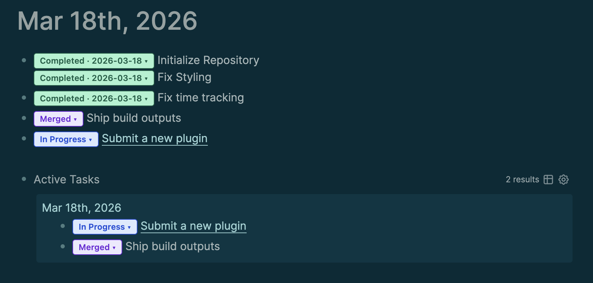

# logseq-inline-task-badge

A Logseq plugin that adds inline, clickable status badges to any block allowing you to track the status of tasks at a glance. Add a status badge to any Logseq block, click to move it through your workflow, and see time spent at a glance.



---

## Getting started

In any block, type `/TASK`. A **Not Started** badge appears inline, right next to your text.

Click it to open a status dropdown. Pick a status and the badge updates immediately. That's it.

---

## Features

### Status badges, inline
Every task gets a color-coded badge that lives inside the block. No sidebars, no separate task views — your status is right where you wrote the task.

### Move tasks forward fast
**Double-click** any badge to jump straight to **In Progress** — no dropdown needed.

### Time tracking built in
The moment you set a task to **In Progress**, a timer starts. The elapsed time shows live on the badge. If you move the task out and back in, time accumulates across sessions.

```
In Progress · 2h 15m ▾
```

When a task is **Completed**, today's date is recorded automatically on the badge.

```
Completed · 2026-03-18 ▾
```

### Struggle with Multitasking?
Enable **Allow 1 In Progress Task** in the plugin settings to enforce focus. If you try to start a second task, you'll get a warning and the transition will be blocked — until you finish or move the active task first.

### Your workflow, your statuses
The default statuses cover a standard dev/comms workflow out of the box:

Default Status:
| Status | Color |
|---|---|
| Not Started | Gray |
| In Progress | Blue |
| Blocked | Red |
| In Review | Amber |
| Merged | Purple |
| Deployed | Green |
| Comms Sent | Cyan |
| Completed | Dark green |

Don't need Merged or Comms Sent? Want to add Waiting or On Hold? Edit the **Task Statuses** setting in the plugin panel — it accepts a JSON list of `{ label, color, bg }` entries.

### Query your tasks
Use Logseq's built-in query language to build live views — all tasks sorted by status, a board of what's In Progress, or everything that's Blocked. See [QUERIES.md](QUERIES.md) for ready-to-paste query blocks.

---

## Development / Installation

1. Clone or download this repo
2. Run `yarn && yarn build`
3. In Logseq, go to **Settings → Plugins → Load unpacked plugin**
4. Select the **root folder** of this repo (not the `dist/` folder)

---

## Development

```bash
yarn               # install dependencies
yarn build         # type-check + build to dist/
yarn type-check    # TypeScript check only
```

See [PLAN.md](PLAN.md) for architecture notes and Logseq-specific gotchas.
